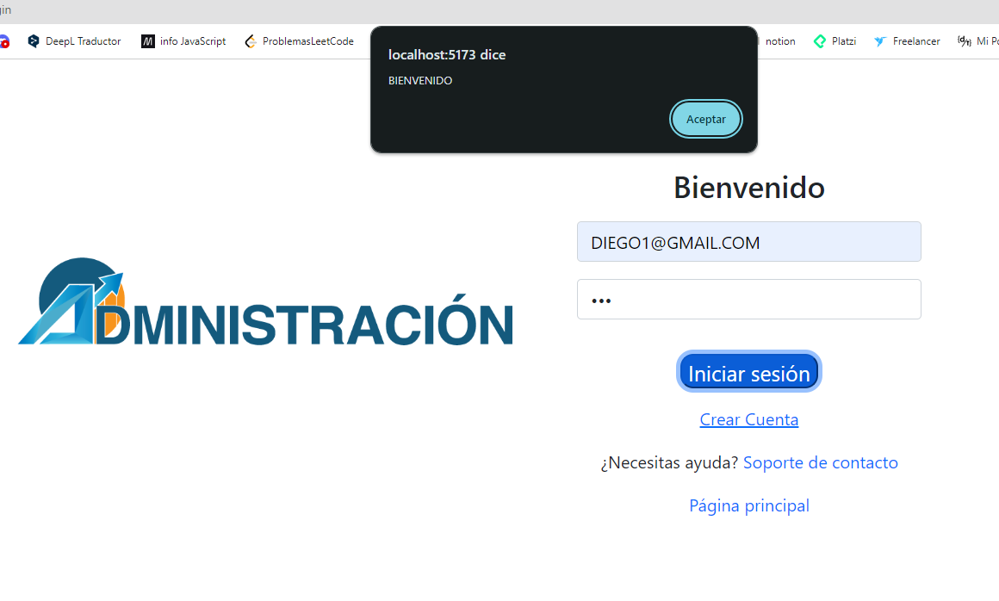

# Backend endpoints:

##### Empleados:

**POST:**

http://127.0.0.1:3535/empleados

**GET** (infor ingresada por body Cedula y Cargo)

http://127.0.0.1:3535/empleados

http://127.0.0.1:3535/empleados/EstadoCargo

http://127.0.0.1:3535/empleados/PorCargo

http://127.0.0.1:3535/empleados/PorCedula

**DELETE**

http://127.0.0.1:3535/empleados/PorCedula

---

##### EstadoEmpleados:

**GET:**

http://127.0.0.1:3535/estadoEmpleados

**POST:**

http://127.0.0.1:3535/estadoEmpleados

**DELETE:**

http://127.0.0.1:3535/estadoEmpleados/PorNombreEstado

---

##### CargoEmpleados:

**GET:**

http://127.0.0.1:3535/cargoEmpleado

**POST:**

http://127.0.0.1:3535/cargoEmpleado

**DELETE:**

http://127.0.0.1:3535/cargoEmpleado/nombreCargo

---

endpoints futuros:

que trabajadores están en cada proyecto

que funciones tengo y en qué proyecto estoy (para el empleado)

arreglar lo de eliminar un empleado de un proyecto

# Frontend avance

#### página principal:

#### login:

inicio con cuenta creada: 

inicio con cuenta no registrada: 

creación de usuario solo frontend:

